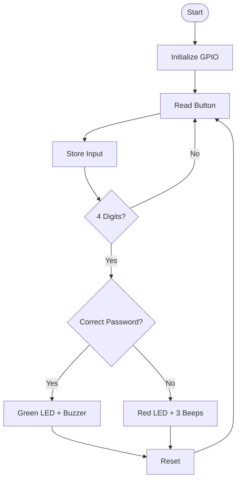

# 🔐 STM32 NUCLEO-F411RE — Bare-Metal Password Lock System

A polling-based, register-level password lock system built on the STM32F411RE — reading three pushbuttons to form a 4-digit sequence, comparing it against a stored password, and signaling success or failure through LEDs and a buzzer. Written entirely in bare-metal C with no HAL, CubeMX code, interrupts, or timers.


---

## 📖 Project Overview

**Purpose**
This project implements a simple electronic password lock on the STM32F411RE Nucleo board, using only direct register manipulation — no HAL, no CubeMX-generated drivers, no interrupts, and no hardware timers. It's a Level 1 bare-metal exercise designed to build real embedded firmware architecture skills: input debouncing, state comparison, and output signaling, all through polling.

**Problem Solved**
Beginners often learn GPIO input/output in isolation. This project combines multiple GPIO concepts — debounced button input, sequence storage, array comparison, and multi-output feedback (dual LEDs + buzzer) — into one cohesive, realistic embedded application, modeled after real access-control hardware.

**Real-World Applications**
This is a simplified model of real keypad/PIN-entry access systems used in door locks, safes, alarm panels, and security keypads — all of which rely on the same core loop: read input, buffer it, compare against a stored code, and drive an output/actuator based on the result.

**Target Users**
- Embedded systems students learning bare-metal STM32 programming
- Developers practicing state-machine and debouncing logic without interrupts
- Anyone using a NUCLEO-F411RE board wanting a hands-on multi-I/O project

---

## ✨ Features

✅ Reads 3 pushbuttons (PC0, PC1, PC2) configured with internal pull-ups — no external resistors required
✅ Software edge-detection debouncing — a single press registers exactly once, even if held down
✅ 4-digit password entry compared against a stored sequence
✅ Green LED + short buzzer tone on a correct password
✅ Red LED + 3 buzzer beeps on an incorrect password
✅ Automatic input reset after every attempt, ready for the next entry
✅ Fully polling-based — no interrupts, timers, or UART used
✅ Modular function structure (`GPIO_Init`, `Read_Button`, `ComparePassword`, `CorrectPassword`, `WrongPassword`, `ResetPassword`)

---

## 🛠️ Technologies Used

| Category | Details |
|---|---|
| **Language** | C (bare-metal, register-level) |
| **MCU** | STM32F411RETx (Cortex-M4, 512KB Flash, 128KB RAM) |
| **Board** | STM32 NUCLEO-F411RE |
| **IDE** | STM32CubeIDE |
| **Toolchain** | GNU ARM GCC (`arm-none-eabi-`) |
| **Debugger/Programmer** | ST-Link (via STM32CubeIDE's built-in GDB server) |
| **Build System** | Eclipse CDT Managed Build (STM32CubeIDE project) |
| **Version Control** | Git & GitHub |

---

## 🔌 Hardware

| Component | Pin | Configuration |
|---|---|---|
| Button 1 | PC0 | Input, internal pull-up |
| Button 2 | PC1 | Input, internal pull-up |
| Button 3 | PC2 | Input, internal pull-up |
| Green LED | PC3 | Output |
| Red LED | PC4 | Output |
| Buzzer | **PA6** | Output |

> **Note on the buzzer pin:** The original design spec called for the buzzer on **PA2**, which was abandoned during development due to a board-level conflict — see "Hardware Debugging Journey" below. The final implementation uses **PA6**, and as of the latest fix, the in-code documentation comment in `GPIO_Init()` now correctly reads "PA6 as output" too (it previously still said PA2, even though the register logic already targeted PA6).

---

## 📂 Folder Structure

```
02_Password_Lock_System/
│
├── .project                                              # Eclipse/STM32CubeIDE project descriptor
├── .cproject                                              # Build configuration (Debug/Release, compiler/linker options)
├── Password_Lock_System Debug.launch                     # Debug launch configuration (ST-Link settings)
├── STM32F411RETX_FLASH.ld                                # Linker script — runs code from Flash
├── STM32F411RETX_RAM.ld                                  # Linker script — runs code from RAM (debug-in-RAM)
│
├── Src/
│   ├── main.c                                              # Application logic — GPIO init, button reading, password check, LED/buzzer feedback
│   ├── syscalls.c                                          # Newlib syscall stubs (auto-generated)
│   └── sysmem.c                                            # Heap management for malloc/newlib (auto-generated)
│
└── Startup/
    └── startup_stm32f411retx.s                              # Reset handler, vector table, stack/data init (assembly)
```

---

## ⚙️ How It Works

1. **Initialization (`GPIO_Init`)** — Enables the GPIOA and GPIOC peripheral clocks, configures PA6 (buzzer), PC3 (green LED), and PC4 (red LED) as outputs, and configures PC0–PC2 (buttons) with internal pull-up resistors so each reads `1` when released and `0` when pressed.
2. **Input Polling (`Read_Button`)** — Runs an infinite loop continuously reading the current state of all three button pins from `GPIOC_IDR`.
3. **Edge Detection & Debounce** — Each button's current reading is compared against its *previous* reading. A press is only registered on the transition from released (`1`) to pressed (`0`), followed by a short software delay and a re-check to confirm the state — preventing a single held-down press from registering multiple times.
4. **Sequence Storage** — Each confirmed press appends the corresponding digit (`1`, `2`, or `3`) into the `User_Password[]` array and increments `buttonIndex`, up to a maximum of 4 entries.
5. **Comparison (`ComparePassword`)** — Once 4 digits have been entered, `User_Password[]` is compared element-by-element against the stored `storedPassword[]` array.
6. **Feedback (`CorrectPassword` / `WrongPassword`)** — Depending on the match result, the green LED + single buzzer tone (correct) or red LED + three buzzer beeps (incorrect) sequence runs.
7. **Reset (`ResetPassword`)** — The input array and index are cleared, and the system waits for the next 4-digit attempt — without ever resetting mid-entry, so a user can pause between presses indefinitely and the system will keep waiting.

---


## 🖼️  Firmware Architecture Flowchart




## 🔍 Code Explanation

**`Src/main.c`**

| Function | Purpose |
|---|---|
| `GPIO_Init()` | Enables GPIOA/GPIOC clocks via `RCC_AHB1ENR`; configures PA6 as output (buzzer); clears and sets PC3/PC4 as outputs (LEDs); configures PC0–PC2 with internal pull-ups (buttons). The function's leading comment block now correctly documents "PA6 as output," matching the register logic below it. |
| `delay()` | A short busy-wait loop (~50,000 iterations) used to debounce button presses after detecting an edge. |
| `delay2()` | A longer busy-wait loop (~300,000 iterations) used to time the buzzer/LED "on" duration during success/failure feedback. |
| `Read_Button()` | The main polling loop. Tracks each button's previous state, detects press edges, debounces, stores digits into `User_Password[]`, and triggers `ComparePassword()` + `ResetPassword()` once 4 digits are collected. |
| `ComparePassword()` | Compares `User_Password[]` against `storedPassword[]` element-by-element, counting matches in `Matched_Password`, then calls `CorrectPassword()` or `WrongPassword()` accordingly. |
| `CorrectPassword()` | Turns on the green LED, ensures the red LED is off, sounds the buzzer for one `delay2()` period, then turns the buzzer and green LED back off. |
| `WrongPassword()` | Blinks the red LED and sounds the buzzer three times in sequence (on/off, repeated 3×) to signal a failed attempt. |
| `ResetPassword()` | Clears `User_Password[]` back to zero and resets `buttonIndex` to 0, readying the system for the next attempt. |
| `main()` | Calls `GPIO_Init()`, then `Read_Button()` (which itself runs forever), followed by an empty infinite loop as a fallback. |

**Global state:**
| Variable | Purpose |
|---|---|
| `storedPassword[4]` | The hardcoded reference password — currently `{1, 2, 3, 1}`. |
| `User_Password[4]` | Buffer holding the digits entered by the user during the current attempt. |
| `buttonIndex` | Tracks how many digits have been entered so far (0–4). |
| `Matched_Password` | Counts how many digits matched during the last comparison. |

> **Note on the stored password:** Early design notes referenced an example sequence of `1 → 3 → 2 → 1`, but the actual `storedPassword[]` array in the current source is `{1, 2, 3, 1}`. This documentation reflects the real code as written rather than the earlier example.

**Modularity vs. the original spec:** The requested breakdown included a separate `Store_Input()` function; in the current implementation, storing each digit is handled inline within `Read_Button()` rather than as its own function. Everything else — `GPIO_Init`, `Read_Button`, `ComparePassword`/`Check_Password`, `CorrectPassword`/`Success_Action`, `WrongPassword`/`Failure_Action`, and `ResetPassword`/`Reset_Input` — matches the requested modular structure.

---

## 🛠️ Hardware Debugging Journey (PA2 → PA5 → PA6)

The buzzer's pin assignment changed during development, and it's worth documenting why — it's a useful lesson in NUCLEO board quirks:

1. **Original design: PA2.** PA2 maps to Arduino pin D1 / Morpho pin 35 on the NUCLEO-F411RE, which is a valid GPIO in principle.
2. **The catch:** PA2 is also wired to the on-board ST-LINK's Virtual COM Port (USART2_TX). On NUCLEO boards, PA2 is connected to the ST-LINK circuitry through solder bridges — meaning that even when configured purely as a GPIO in firmware, the ST-LINK hardware can still "load" the pin and interfere with its behavior.
3. **Symptom:** PA2 only reached about 0.7–1.7V instead of a clean logic level, the LED wired to it wouldn't light, and the buzzer only buzzed weakly — all consistent with the pin being partially loaded by the ST-LINK's onboard circuitry rather than being freely driven by the MCU.
4. **Isolating the problem:** To verify the register-level GPIO configuration itself was correct (separate from the PA2-specific issue), PA5 was used as a temporary test pin, since PA5 drives the NUCLEO board's onboard LD2 LED. Configuring PA5 as output and driving it high confirmed the green onboard LED turned on — proving the GPIOA clock enable and register logic were correct, and that the fault was specific to PA2.
5. **Resolution:** The buzzer was moved to **PA6**, a pin with no conflicting on-board ST-LINK connection, resolving the issue entirely. The current `main.c` reflects this final PA6 configuration.

**Takeaway:** On NUCLEO boards, always check the board's user manual/schematic for pins shared with onboard peripherals (ST-LINK VCP, LD2, USER button, etc.) before wiring external components to them — a pin that looks free in the datasheet may still be electrically connected to onboard circuitry.

---

## 💻 Installation

**1. Clone the repository**
```bash
git clone https://github.com/anshukumar146/github.git
cd github/NUCLEOF411RE/02_Password_Lock_System
```

**2. Install STM32CubeIDE**
Download and install from [st.com/en/development-tools/stm32cubeide.html](https://www.st.com/en/development-tools/stm32cubeide.html) if not already installed.

**3. Import the project**
- Open STM32CubeIDE
- Go to **File → Open Projects from File System...**
- Select the `02_Password_Lock_System` folder
- Click **Finish** to import

---

## ▶️ Running the Project

1. Wire the hardware as described in the table above:
   - 3 pushbuttons on PC0, PC1, PC2 (internal pull-ups handle idle-high state — no external resistors needed)
   - Green LED (with current-limiting resistor) on PC3
   - Red LED (with current-limiting resistor) on PC4
   - Buzzer on **PA6**
2. Connect the NUCLEO-F411RE board to your computer via USB.
3. In STM32CubeIDE, select the project in the Project Explorer.
4. Click **Build** to compile.
5. Click **Run → Debug** (using the `Password_Lock_System Debug.launch` configuration) to flash the firmware via ST-Link.
6. Once flashed, the system runs automatically and waits for a 4-button password sequence.

---

## 🧑‍💻 Usage

1. Press the buttons in sequence to enter a 4-digit password (Button 1 = `1`, Button 2 = `2`, Button 3 = `3`).
2. Each press is registered exactly once — holding a button down will not repeat the input.
3. You may pause between presses for as long as needed; the system keeps waiting rather than timing out or resetting.
4. After the 4th digit is entered:
   - **Correct password** (`1, 2, 3, 1`) → Green LED turns on, buzzer sounds briefly, then both turn off.
   - **Incorrect password** → Red LED and buzzer pulse together 3 times.
5. The input buffer resets automatically after every attempt — ready for the next try immediately.

---

## 🖼️  Hardware Schematic


Note: R3, R4, and R5 provide external pull-ups for PC0, PC1, and PC2. In the current firmware, the STM32's internal pull-ups are also enabled via GPIOC_PUPDR, so these external resistors are optional and can be removed. They are included here to illustrate an alternative hardware pull-up implementation and to ensure the circuit would still operate even if the internal pull-ups were not configured.

---

## 🖼️  Screenshots


---


## 🎥 Demo Video


https://github.com/user-attachments/assets/4da4d190-00d2-4a72-be80-fbe68845e56f


---

## 📊 Results

- Entering `1 → 2 → 3 → 1` triggers the success sequence: green LED on, one buzzer tone, then off.
- Entering any other 4-digit combination of `1`, `2`, `3` triggers the failure sequence: red LED + buzzer pulsing 3 times.
- Holding a button down produces exactly one stored digit, not a repeated stream, thanks to the edge-detection debounce logic.
- The system never auto-resets mid-entry — it always waits indefinitely for the 4th digit if the user pauses.

---

## 🚀 Future Improvements

- Move debouncing and buzzer/LED timing to `SysTick` or a hardware timer instead of busy-wait `delay()`/`delay2()` loops, freeing the CPU from blocking delays
- Add an `EXTI`-based interrupt-driven button read as an alternate branch, to compare against the current polling-only approach
- Make the password configurable at runtime rather than hardcoded in `storedPassword[]`
- Add a "lockout" feature after repeated failed attempts (e.g., disable input for N seconds after 3 consecutive wrong entries)
- Break `Read_Button()`'s inline digit-storage logic into a dedicated `Store_Input()` function to fully match the originally requested modular structure

---

## 🎓 Learning Outcomes

By studying and building this project, you will learn:

- Configuring GPIO pins as input-with-pull-up and output at the register level (`MODER`, `PUPDR`)
- Implementing software edge-detection debouncing without interrupts or timers
- Designing a simple state machine (collect input → compare → give feedback → reset) in bare-metal C
- Structuring firmware into modular, single-responsibility functions
- Diagnosing real hardware quirks — like NUCLEO pins shared with onboard ST-LINK circuitry — through systematic isolation testing
- Driving multiple outputs (dual LEDs + buzzer) in coordinated feedback sequences

---

## 🧩 Skills Demonstrated

- Bare-Metal Embedded C Programming
- ARM Cortex-M Register-Level GPIO Control (input pull-up, output, clock enables)
- Software Debouncing & Edge Detection
- State-Machine Design for Embedded Systems
- Hardware Debugging & Root-Cause Isolation
- Modular Embedded Firmware Architecture
- STM32CubeIDE Project Setup & ST-Link Debugging

---

## 👤 Author

**Name:** Anshu Kumar
**GitHub:** [@anshukumar146](https://github.com/anshukumar146)
**LinkedIn:** _(add your LinkedIn URL here)_
**Email:** _(add your email here)_

---

## 📜 License

This project is licensed under the **MIT License**. Note that `syscalls.c`, `sysmem.c`, `startup_stm32f411retx.s`, and the `.ld` linker scripts are STM32CubeIDE/STMicroelectronics-generated boilerplate, licensed under terms provided by STMicroelectronics (see file headers).

```
MIT License

Copyright (c) 2026 Anshu Kumar

Permission is hereby granted, free of charge, to any person obtaining a copy
of this software and associated documentation files (the "Software"), to deal
in the Software without restriction, including without limitation the rights
to use, copy, modify, merge, publish, distribute, sublicense, and/or sell
copies of the Software, and to permit persons to whom the Software is
furnished to do so, subject to the following conditions:

The above copyright notice and this permission notice shall be included in all
copies or substantial portions of the Software.

THE SOFTWARE IS PROVIDED "AS IS", WITHOUT WARRANTY OF ANY KIND, EXPRESS OR
IMPLIED, INCLUDING BUT NOT LIMITED TO THE WARRANTIES OF MERCHANTABILITY,
FITNESS FOR A PARTICULAR PURPOSE AND NONINFRINGEMENT. IN NO EVENT SHALL THE
AUTHORS OR COPYRIGHT HOLDERS BE LIABLE FOR ANY CLAIM, DAMAGES OR OTHER
LIABILITY, WHETHER IN AN ACTION OF CONTRACT, TORT OR OTHERWISE, ARISING FROM,
OUT OF OR IN CONNECTION WITH THE SOFTWARE OR THE USE OR OTHER DEALINGS IN THE
SOFTWARE.
```

---

## 🙏 Acknowledgements

- STMicroelectronics for STM32CubeIDE and the auto-generated project scaffolding (linker scripts, startup code, syscalls)
- The STM32F411xC/E Reference Manual and NUCLEO-F411RE User Manual (UM1724) for register and board pin-mapping documentation
- The embedded systems community for resources on bare-metal ARM Cortex-M programming and NUCLEO board pin-sharing quirks

---

<div align="center">

⭐ If you found this repository helpful, consider giving it a star!

</div>
