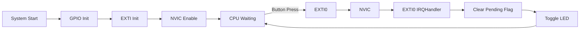

# ⚡ STM32 NUCLEO-F411RE — Bare-Metal Interrupt-Driven LED Toggle

A register-level STM32F411RE project that toggles an LED using a **hardware interrupt** (EXTI) triggered by a button press, instead of continuously polling the pin in a loop. Written entirely in bare-metal C with no HAL or CubeMX-generated drivers.


---

## 📖 Project Overview

**Primary Objective**
Develop a bare-metal external interrupt application on the STM32F411RE using EXTI0, without STM32 HAL, CubeMX-generated code, or external libraries.

**Secondary Objectives**
- Learn how external interrupts work internally on STM32
- Configure a GPIO pin as an interrupt input
- Configure the EXTI and SYSCFG peripherals correctly
- Detect a button press via interrupt instead of polling
- Eliminate continuous CPU polling
- Execute code only when an external hardware event occurs
- Understand the complete interrupt flow from GPIO to CPU

**Problem Statement**
Polling continuously checks a button's state in a loop, wasting CPU time and reducing efficiency — the earlier bare-metal projects in this series (`01_Interfacing_LED_and_Buzzer_with_button`, `02_Password_Lock_System`) both work this way. This project's objective was to design an interrupt-driven button detection system instead, where the CPU remains idle until a button press generates a genuine external interrupt — demonstrating how STM32 reacts to hardware events efficiently using EXTI and NVIC, rather than through delay-based, always-checking programming.

**Real-World Applications**
Interrupt-driven GPIO is the standard approach in real embedded systems — used for responding to button presses, sensor triggers, communication events, and safety-critical signals (like emergency stops) without the latency and CPU waste of constant polling.

**Target Users**
- Embedded systems students moving from polling-based to interrupt-driven STM32 programming
- Developers wanting a minimal, from-scratch example of EXTI + NVIC configuration without HAL
- Anyone using a NUCLEO-F411RE board wanting to understand how a hardware interrupt is wired end-to-end

---

## ✨ Features

✅ Configures an external interrupt (EXTI0) on PC0, triggered on a falling edge
✅ Routes GPIOC as the EXTI0 source via `SYSCFG_EXTICR1`
✅ Enables the interrupt line in the NVIC (`NVIC_ISER0`)
✅ Implements a dedicated `EXTI0_IRQHandler()` interrupt service routine
✅ Toggles an LED (PC3) directly from within the ISR using XOR on `GPIOC_ODR`
✅ `main()` stays idle in an empty loop — all button-response logic lives in the ISR
✅ Fully register-level — no HAL, no CubeMX-generated peripheral code

---

## 🛠️ Technologies Used

| Category | Details |
|---|---|
| **Language** | C (bare-metal, register-level) |
| **MCU** | STM32F411RETx (Cortex-M4, 512KB Flash, 128KB RAM) |
| **Board** | STM32 NUCLEO-F411RE |
| **IDE** | STM32CubeIDE |
| **Toolchain** | GNU ARM GCC (`arm-none-eabi-`) |
| **Debugger/Programmer** | ST-Link (via STM32CubeIDE's built-in GDB server) |
| **Build System** | Eclipse CDT Managed Build (STM32CubeIDE project) |
| **Version Control** | Git & GitHub |

---

## 🔌 Hardware

| Component | Pin | Configuration |
|---|---|---|
| Button | PC0 | Input, internal pull-up, EXTI0 interrupt source (falling edge) |
| LED | PC3 | Output |

> **Note on hardware scope:** Project notes listed a Red LED and an Active Buzzer as hardware used, alongside GPIOA "if buzzer/LED connected." However, the current `main.c` only initializes and drives **GPIOC** — specifically PC0 (button/EXTI0) and PC3 (single LED). No GPIOA configuration, second LED, or buzzer logic exists in the source as it stands today. This documentation reflects the code as written; the Red LED and buzzer appear to be planned/optional additions rather than implemented features.

---

## 📂 Folder Structure

```
03_Interrupt_LED_Toggle/
│
├── .project                                        # Eclipse/STM32CubeIDE project descriptor
├── .cproject                                        # Build configuration (Debug/Release, compiler/linker options)
├── Interrupt_LED_Toggle Debug.launch               # Debug launch configuration (ST-Link settings)
├── STM32F411RETX_FLASH.ld                          # Linker script — runs code from Flash
├── STM32F411RETX_RAM.ld                            # Linker script — runs code from RAM (debug-in-RAM)
│
├── Src/
│   └── main.c                                        # GPIO, EXTI, and NVIC configuration + interrupt handler
│
└── Startup/
    └── startup_stm32f411retx.s                        # Reset handler, vector table (includes EXTI0_IRQHandler entry)
```

---

## ⚙️ How It Works

1. **GPIO Setup (`GPIO_Init`)** — Enables the GPIOC peripheral clock, configures PC0 as an input with an internal pull-up (so it idles HIGH and reads LOW when pressed), and configures PC3 as a general-purpose output for the LED.
2. **EXTI Setup (`EXTI_Config`)** — Enables the SYSCFG clock (required to route EXTI lines), maps EXTI line 0 to GPIOC via `SYSCFG_EXTICR1`, unmasks EXTI line 0 in the interrupt mask register, and enables a **falling-edge** trigger (matching the button pulling PC0 LOW when pressed) while explicitly disabling the rising-edge trigger.
3. **NVIC Setup (`NVIC_Config`)** — Enables IRQ6 (the EXTI0 interrupt line) in the NVIC's interrupt set-enable register, allowing the CPU to actually respond when the EXTI0 event fires.
4. **Idle Main Loop** — `main()` calls the three setup functions once, then enters an empty `while(1)` loop — it does nothing but wait; all the actual work happens asynchronously in the interrupt handler.
5. **Interrupt Service Routine (`EXTI0_IRQHandler`)** — When the button is pressed (falling edge on PC0), the CPU automatically jumps to this handler. It clears the pending interrupt flag (`EXTI_PR`), toggles the LED on PC3 via XOR on `GPIOC_ODR`, and returns — resuming whatever `main()` was doing.

---




## 🔍 Code Explanation

**`Src/main.c`**

| Function | Purpose |
|---|---|
| `GPIO_Init()` | Enables the GPIOC clock; configures PC0 as input with pull-up (button) and PC3 as output (LED). |
| `EXTI_Config()` | Enables the SYSCFG clock; connects EXTI line 0 to GPIOC (`SYSCFG_EXTICR1`); unmasks EXTI0 (`EXTI_IMR`); enables falling-edge trigger and disables rising-edge trigger (`EXTI_FTSR` / `EXTI_RTSR`). |
| `NVIC_Config()` | Enables IRQ6 in the NVIC (`NVIC_ISER0`), which corresponds to the EXTI0 interrupt line on this device. |
| `EXTI0_IRQHandler()` | The interrupt service routine. Clears the EXTI0 pending flag (required to prevent the interrupt from re-firing immediately), then toggles PC3 (the LED). |
| `main()` | Calls `GPIO_Init()`, `EXTI_Config()`, and `NVIC_Config()` once at startup, then idles in an empty `while(1)` loop, relying entirely on the interrupt to drive LED behavior. |

**Register groups used:**
| Peripheral | Registers | Purpose |
|---|---|---|
| RCC | `AHB1ENR`, `APB2ENR` | Enables clocks for GPIOC and SYSCFG |
| GPIOC | `MODER`, `PUPDR`, `ODR` | Pin mode, pull-up configuration, and output driving |
| SYSCFG | `EXTICR1` | Selects which GPIO port feeds a given EXTI line |
| EXTI | `IMR`, `RTSR`, `FTSR`, `PR` | Interrupt mask, edge trigger selection, and pending-flag clearing |
| NVIC | `ISER0` | Enables the specific interrupt line at the CPU level |

**Important detail — no debounce logic:** Unlike the polling-based projects in this series, this interrupt handler contains **no software debouncing**. A single physical button press can produce multiple rapid falling edges due to mechanical contact bounce, and each one will trigger the ISR independently — meaning a "single press" may toggle the LED more than once in practice. This is a known limitation of the current implementation (see "Future Improvements").

**Vector table note:** `EXTI0_IRQHandler` is declared as a `.weak` alias to `Default_Handler` in `startup_stm32f411retx.s`. Because `main.c` defines its own non-weak `EXTI0_IRQHandler()`, the linker uses that definition instead of the default, routing the actual interrupt to the application's handler — this is standard STM32 startup file behavior and requires no manual vector table editing.

---

## 🧠 Key Concepts Mastered

**1. Polling vs. Interrupts**
The core distinction this project is built around: continuously checking a button (polling) versus letting hardware notify the CPU only when an event occurs.

**2. SYSCFG-to-EXTI Mapping**
A GPIO pin must first be mapped to an EXTI line using the SYSCFG external interrupt configuration registers before it can generate an interrupt:
```
PC0 → SYSCFG_EXTICR1 → EXTI0
```

**3. Interrupt Mask Register (IMR)**
EXTI lines stay disabled until explicitly unmasked via `EXTI_IMR` — configuring the trigger edge alone isn't enough.

**4. Edge Trigger Selection**
STM32 lets you choose rising edge, falling edge, or both. This project deliberately enables only the falling-edge trigger (`EXTI_FTSR`) and disables the rising-edge trigger (`EXTI_RTSR`), matching a button that pulls the pin LOW when pressed.

**5. Pending Register (PR) — a different clearing mechanism than timers**
After an interrupt fires, its pending bit is set. For EXTI specifically, that bit is cleared by **writing a 1** to it (`EXTI_PR = (1 << 0)`) — this is a different convention than some other STM32 peripherals use, and it's exactly what `EXTI0_IRQHandler()` does as its first action.

**6. NVIC Is a Separate Enable Step**
Enabling an EXTI line inside the peripheral is not sufficient — the corresponding IRQ must *also* be enabled in the NVIC (`NVIC_ISER0`) before the CPU will actually execute the ISR when the event occurs.

**7. ISR Naming Must Match the Vector Table Exactly**
The interrupt handler function name (`EXTI0_IRQHandler`) must match the name declared in the startup file's vector table precisely — any other name will simply never be called by the CPU, silently failing with no compiler error.

**8. Full Interrupt Flow**
```
Button Press → GPIO detects edge → EXTI Pending Flag → NVIC → CPU → EXTI0_IRQHandler() → Clear Pending Flag → Execute task
```

**9. Interrupt-Driven vs. Delay-Based Programming**
Instead of:
```c
while(1) {
    delay();
    LED ^= 1;
}
```
this project demonstrates the interrupt-driven equivalent — the CPU waits idle, and hardware itself triggers the response, which is significantly more efficient.

---

## 🐛 Problems Faced During Development

Based on the development notes for this project, the following areas required the most work to understand correctly:

- Understanding the full interrupt flow end-to-end
- Distinguishing polling from interrupt-driven design conceptually, not just in code
- Understanding exactly what SYSCFG mapping does and why it's a separate step from EXTI configuration
- Selecting the correct EXTI line for a given GPIO pin
- Telling rising-edge and falling-edge triggers apart and choosing the right one for the hardware
- Understanding why `EXTI_IMR` (the mask register) is required at all
- Understanding what the NVIC enable step actually does, versus what the peripheral-level enable does
- Recognizing that the ISR function name must exactly match the startup file's vector table entry
- Understanding pending-register behavior, specifically that `EXTI_PR` is cleared by **writing 1**, which differs from how a timer peripheral's status register (e.g., `TIM2_SR`) is typically cleared

---

## 💡 Skills Gained

- Reading the STM32 Reference Manual directly, rather than copying pre-written code
- Register-level GPIO and interrupt programming
- External interrupt (EXTI) configuration
- NVIC configuration
- Interrupt debugging
- ISR development
- Event-driven firmware design
- Hardware/software integration

---

## 💻 Installation

**1. Clone the repository**
```bash
git clone https://github.com/anshukumar146/github.git
cd github/NUCLEOF411RE/03_Interrupt_LED_Toggle
```

**2. Install STM32CubeIDE**
Download and install from [st.com/en/development-tools/stm32cubeide.html](https://www.st.com/en/development-tools/stm32cubeide.html) if not already installed.

**3. Import the project**
- Open STM32CubeIDE
- Go to **File → Open Projects from File System...**
- Select the `03_Interrupt_LED_Toggle` folder
- Click **Finish** to import

---

## ▶️ Running the Project

1. Wire the hardware: a pushbutton to **PC0** (internal pull-up handles idle-high state — no external resistor needed) and an LED (with a current-limiting resistor) to **PC3**.
2. Connect the NUCLEO-F411RE board to your computer via USB.
3. In STM32CubeIDE, select the project in the Project Explorer.
4. Click **Build** to compile.
5. Click **Run → Debug** (using the `Interrupt_LED_Toggle Debug.launch` configuration) to flash the firmware via ST-Link.
6. Once flashed, the program runs automatically — press the button to toggle the LED.

---

## 🧑‍💻 Usage

- **Press the button** connected to PC0 → the falling edge triggers `EXTI0_IRQHandler()`, toggling the LED on PC3.
- **No polling delay** — the response happens as soon as the interrupt fires, rather than waiting for the next loop iteration as in a polling design.
- Because there's no debounce logic, be aware that a single press may occasionally cause more than one toggle if contact bounce produces multiple falling edges (see the note above).


---

## 🖼️ Schematic diagram


Note: R2 provide external pull-ups for PC0. In the current firmware, the STM32's internal pull-ups are also enabled via GPIOC_PUPDR, so these external resistors are optional and can be removed. They are included here to illustrate an alternative hardware pull-up implementation and to ensure the circuit would still operate even if the internal pull-ups were not configured.

---


## 🖼️ Hardware connection


---

## 🎥 Demo Video


https://github.com/user-attachments/assets/ef4526c1-a4a3-414a-add7-94d8552f13ce


---

## 📊 Results

- Pressing the button reliably toggles the LED via the interrupt path, with `main()` doing no active work between presses.
- The CPU spends the vast majority of its time idle in the empty `while(1)` loop rather than continuously reading GPIO state, unlike the polling-based projects in this series.
- Due to the lack of debouncing, rapid or noisy mechanical bounce on the button may occasionally register as more than one toggle per physical press.

---

## 🚀 Future Improvements

- Add debounce handling for the interrupt path — e.g., a short blocking delay at the start of the ISR, or a software flag combined with a periodic check, to filter out bounce-induced multiple triggers
- Put the CPU into a low-power sleep mode (`WFI` — Wait For Interrupt) inside the empty `main()` loop, rather than spinning in a busy `while(1)`, to actually realize the power-saving benefit interrupts are meant to provide
- Extend the project to handle multiple EXTI lines (e.g., additional buttons on different pins) to demonstrate priority and multiple ISR handling via the NVIC
- Add a counter incremented in the ISR to track total press events, useful for verifying debounce fixes
- Document actual measured bounce behavior (e.g., via oscilloscope or a debug counter) to quantify how often multi-triggering occurs on this specific hardware setup

---

## 🎓 Learning Outcomes

By studying and building this project, you will learn:

- How to configure a GPIO pin as an external interrupt source at the register level
- The full chain required for a working hardware interrupt: GPIO config → SYSCFG line routing → EXTI mask/trigger setup → NVIC enable → ISR implementation
- Why an interrupt's pending flag must be cleared inside the ISR before returning
- The practical difference between polling-based and interrupt-driven input handling
- Why interrupt handlers should generally be short and why debounce logic matters even more in an ISR context
- How STM32's startup file uses weak symbol aliasing to let application code override default interrupt handlers

**By completing this project, you should be able to confidently explain:**
- How a GPIO pin generates a hardware interrupt
- Why SYSCFG mapping between a GPIO port and an EXTI line is necessary
- The practical difference between polling and interrupt-driven design
- The difference between `EXTI_IMR` (peripheral-level enable) and the NVIC (CPU-level enable)
- Rising-edge vs. falling-edge triggers, and when to use each
- Why `EXTI0_IRQHandler()` must have that exact name to be called
- Why EXTI pending flags are cleared by writing 1, not 0
- The complete interrupt flow from a physical button press through to ISR execution

---

## 🧩 Skills Demonstrated

- Bare-Metal Embedded C Programming
- ARM Cortex-M Interrupt Handling (EXTI, NVIC)
- STM32 Peripheral Clock & Pin Configuration
- Interrupt Service Routine (ISR) Design
- STM32CubeIDE Project Setup & ST-Link Debugging
- Embedded Systems Documentation

---

## 👤 Author

**Name:** Anshu Kumar
**GitHub:** [@anshukumar146](https://github.com/anshukumar146)
**LinkedIn:** _(add your LinkedIn URL here)_
**Email:** _(add your email here)_

---

## 📜 License

This project is licensed under the **MIT License**. Note that `startup_stm32f411retx.s` and the `.ld` linker scripts are STM32CubeIDE/STMicroelectronics-generated boilerplate, licensed under terms provided by STMicroelectronics (see file headers).

```
MIT License

Copyright (c) 2026 Anshu Kumar

Permission is hereby granted, free of charge, to any person obtaining a copy
of this software and associated documentation files (the "Software"), to deal
in the Software without restriction, including without limitation the rights
to use, copy, modify, merge, publish, distribute, sublicense, and/or sell
copies of the Software, and to permit persons to whom the Software is
furnished to do so, subject to the following conditions:

The above copyright notice and this permission notice shall be included in all
copies or substantial portions of the Software.

THE SOFTWARE IS PROVIDED "AS IS", WITHOUT WARRANTY OF ANY KIND, EXPRESS OR
IMPLIED, INCLUDING BUT NOT LIMITED TO THE WARRANTIES OF MERCHANTABILITY,
FITNESS FOR A PARTICULAR PURPOSE AND NONINFRINGEMENT. IN NO EVENT SHALL THE
AUTHORS OR COPYRIGHT HOLDERS BE LIABLE FOR ANY CLAIM, DAMAGES OR OTHER
LIABILITY, WHETHER IN AN ACTION OF CONTRACT, TORT OR OTHERWISE, ARISING FROM,
OUT OF OR IN CONNECTION WITH THE SOFTWARE OR THE USE OR OTHER DEALINGS IN THE
SOFTWARE.
```

---

## 🙏 Acknowledgements

- STMicroelectronics for STM32CubeIDE and the auto-generated project scaffolding (linker scripts, startup code)
- The STM32F411xC/E Reference Manual for EXTI, SYSCFG, and NVIC register documentation
- The embedded systems community for resources on bare-metal ARM Cortex-M interrupt handling

---

<div align="center">

⭐ If you found this repository helpful, consider giving it a star!

</div>
