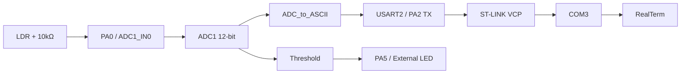

# 💡 ADC-Based LDR Light Sensor with USART Debugging (STM32 Bare-Metal)

**Difficulty Level:** Intermediate

A bare-metal STM32 project that reads an LDR (light-dependent resistor) through the on-chip ADC and streams the raw reading over USART2 to a PC (via RealTerm), while driving an external LED once the reading crosses a fixed threshold — all configured through direct register access (RCC, GPIO, ADC1, USART2), with no HAL calls. Tested and verified on real hardware: dark readings of ~0–50, bright readings of ~3900–4025, and confirmed automatic LED switching at the threshold.


---

## 📖 Project Overview

This project samples an analog voltage from an LDR-and-resistor voltage divider on PA0 using ADC1 in single-conversion, software-triggered mode, converts the 12-bit result to a 4-digit ASCII string, and transmits it over USART2 to a PC running RealTerm. An external LED on PA5 is switched based on a fixed ADC threshold (2000), selected from real hardware measurements: dark ≈ 0–50, bright ≈ 3900–4025. No HAL/LL drivers are used — every peripheral (GPIO, ADC1, USART2) is configured directly through memory-mapped registers.

**Project Name (from the STM32CubeIDE launch configuration):** `Project_08_STM32F411RE_ADC_Based_LDR_Light_Sensor_with_USART_Debugging`

**Real-World Applications**
- A reference for register-level STM32 ADC configuration and single-channel polling
- A pattern for streaming sensor data over UART for debugging without a debugger attached
- A base for any threshold-triggered analog sensor → digital output project (light, temperature, etc.)

**Target Users**
- Embedded systems students learning STM32 ADC and USART register-level programming
- Developers who want to understand analog sampling and serial debugging without abstraction layers
- Anyone building a simple light-triggered actuator/indicator from scratch in bare-metal C

---

## ✨ Features

- 12-bit, single-conversion, software-triggered ADC reading on PA0 (ADC1_IN0)
- Programmable ADC sampling time and ADC clock prescaler
- USART2 transmit-only debug output at 115200 baud (PA2, AF7)
- ADC value converted to a 4-digit, zero-padded ASCII string and sent every loop with a `\r\n` terminator
- Continuous serial monitoring via RealTerm over the ST-LINK Virtual COM Port
- Automatic, threshold-based control of an external LED (PA5) driven directly from the ADC reading
- Fixed-iteration busy-wait delay between samples to avoid flooding the serial terminal

---

## 🛠️ Technologies Used

- **MCU:** STM32F411RE (Nucleo-F411RE), ARM Cortex-M4
- **Language:** Bare-metal C (direct register manipulation, no HAL/LL drivers)
- **Toolchain:** STM32CubeIDE (GCC ARM toolchain, `arm-none-eabi-gcc`)
- **Peripherals:** RCC, GPIOA, ADC1, USART2
- **Debug:** Serial terminal over USART2 (e.g. via the Nucleo board's ST-Link Virtual COM Port on PA2/PA3)

---

## 📁 Folder Structure

```
08_ADC_Based_LDR_Light_Sensor_with_USART_Debugging/
├── Src/
│   ├── main.c              # GPIO/ADC1/USART2 init, sampling loop, LED threshold logic
│   ├── syscalls.c           # Auto-generated syscall stubs
│   └── sysmem.c              # Auto-generated heap management stubs
├── Startup/
│   └── startup_stm32f411retx.s   # Reset handler and vector table
├── STM32F411RETX_FLASH.ld    # Flash linker script
├── STM32F411RETX_RAM.ld       # RAM linker script
├── .project / .cproject        # STM32CubeIDE project files
└── ...Debug.launch              # Debug launch configuration
```

---

## 🔌 Hardware & Connections

| Component | Purpose |
|---|---|
| STM32 Nucleo-F411RE | Main microcontroller |
| LDR | Light sensor |
| 10 kΩ resistor | LDR voltage divider |
| External LED | Dark-condition indicator |
| 220 Ω / 330 Ω resistor | LED current limiting |
| USB cable | Programming + power + ST-LINK Virtual COM Port |
| PC + RealTerm | Serial monitoring of ADC readings |

**LDR voltage divider**

```
             3.3V
               │
              LDR
               │
               ├────────── PA0
               │
             10 kΩ
               │
              GND
```

| LDR Circuit | STM32F411RE |
|---|---|
| LDR upper side | 3.3 V |
| LDR lower side | PA0 |
| 10 kΩ resistor upper side | PA0 |
| 10 kΩ resistor lower side | GND |

With the LDR on top (toward 3.3V) and the fixed resistor on the bottom (toward GND), an LDR's resistance drops as light increases, so more light pulls the PA0 node *up* toward 3.3V — giving a **higher** ADC reading in bright conditions and a **lower** one in the dark. This matches the measured hardware behavior below (dark ≈ 0–50, bright ≈ 3900–4025).

**External LED**

```
PA5
 │
[330 Ω]
 │
 LED Anode (+)
 LED Cathode (-)
 │
GND
```

**USART2 (to PC)**

```
STM32 PA2
   ↓
USART2_TX
   ↓
ST-LINK Virtual COM Port
   ↓
USB
   ↓
PC → RealTerm
```

No RX connection is required — this project only transmits ADC data (USART2 receiver is never enabled in firmware).

---

## ⚙️ How It Works

1. `GPIO_Init()` enables the GPIOA clock, sets PA0 to analog mode (for ADC1_IN0), and sets PA5 to output mode (driving the external LED).
2. `ADC_Init()` enables the ADC1 clock, sets 12-bit resolution, sets a sampling time of 84 cycles on channel 0, configures a 1-conversion regular sequence with channel 0 first, sets single-conversion/software-triggered/right-aligned mode, turns the ADC on, and sets the ADC clock prescaler to PCLK2/8. With an assumed 16 MHz PCLK2, that's a 2 MHz ADC clock (500 ns/cycle), so the 84-cycle sampling time works out to ~42 µs — chosen to give the relatively high-impedance LDR divider enough acquisition time.
3. `USART2_INIT()` enables the USART2 clock, sets PA2 to Alternate Function 7 (USART2_TX), configures the baud-rate register for ~115200 baud (assuming the default 16 MHz HSI clock on APB1), and enables the transmitter and the USART peripheral. **Note:** only the transmitter (`TE`) is enabled — the receiver (`RE`) is not, so this configuration can only send data, not receive it.
4. The main loop repeatedly:
   - Calls `ADC_Read()`, which sets `SWSTART` to begin a conversion and polls the status register until it indicates completion, then returns the 12-bit result from the data register.
   - Calls `ASCII_conversion()`, which splits the value into thousands/hundreds/tens/ones digits and sends each as an ASCII character over USART2, followed by `\r\n`.
   - Waits in a fixed busy-wait `delay()` loop.
   - Calls `LED_Control()`, which turns PA5 on (external LED, dark condition) if the ADC reading is below 2000, and off (bright condition) otherwise. This threshold was chosen from bench measurements — see "LDR Threshold" below — which showed a wide separation between dark (~0–50) and bright (~3900–4025) readings, so 2000 sits comfortably in the middle.

---

## 🧩 Code Explanation (Register-Level)

**RCC**

| Register | Bit(s) | Field | Value | Purpose |
|---|---|---|---|---|
| AHB1ENR | 0 | GPIOAEN | 1 | Enables GPIOA clock |
| APB2ENR | 8 | ADC1EN | 1 | Enables ADC1 clock |
| APB1ENR | 17 | USART2EN | 1 | Enables USART2 clock |

**GPIOA**

| Register | Bit(s) | Field | Value | Purpose |
|---|---|---|---|---|
| MODER | [1:0] | MODER0 | 11 | PA0 = Analog mode (ADC1_IN0) |
| MODER | [11:10] | MODER5 | 01 | PA5 = Output mode (external LED) |
| MODER | [5:4] | MODER2 | 10 | PA2 = Alternate Function mode |
| AFRL | [11:8] | AFSEL2 | 0111 | PA2 → AF7 (USART2_TX) |
| ODR | 5 | ODR5 | 1 / 0 | Drives the external LED on PA5 |

**ADC1**

| Register | Bit(s) | Field | Value | Purpose |
|---|---|---|---|---|
| CR1 | [25:24] | RES | 00 | 12-bit resolution |
| SMPR2 | [2:0] | SMP0 | 100 | Channel 0 sampling time = 84 cycles |
| SQR1 | [23:20] | L | 0000 | 1 conversion in the regular sequence |
| SQR3 | [4:0] | SQ1 | 00000 | Channel 0 selected as the 1st conversion |
| CR2 | 0 | ADON | 1 | Turns the ADC on |
| CR2 | 1 | CONT | 0 | Single-conversion mode (not continuous) |
| CR2 | 11 | ALIGN | 0 | Right-aligned data in `ADC_DR` |
| CR2 | 10 | EOCS | 0 | EOC flag set at end of the regular sequence |
| CR2 | [29:28] | EXTEN | 00 | Hardware trigger disabled — software start only |
| CR2 | 30 | SWSTART | 1 | Starts a regular conversion (set in `ADC_Read()`) |
| SR | 1 | EOC | polled | End-of-conversion flag, polled before reading `ADC_DR` |
| DR | [11:0] | DATA | — | 12-bit conversion result |
| CCR | [17:16] | ADCPRE | 11 | ADC clock = PCLK2 / 8 |

**USART2**

| Register | Bit(s) | Field | Value | Purpose |
|---|---|---|---|---|
| CR1 | 15 | OVER8 | 0 | Oversampling by 16 |
| CR1 | 3 | TE | 1 | Transmitter enabled |
| CR1 | 13 | UE | 1 | USART enabled |
| BRR | [15:4] | DIV_Mantissa | 8 | Baud-rate mantissa |
| BRR | [3:0] | DIV_Fraction | 11 | Baud-rate fraction (mantissa+fraction ≈ 8.6875 → ~115200 baud at 16 MHz PCLK1) |
| SR | 7 | TXE | polled | Transmit data register empty, polled before each write to `DR` |
| DR | [8:0] | DATA | — | Byte written here is transmitted |

---

## 🔆 LDR Threshold Selection

The 2000 threshold wasn't arbitrary — it was chosen after taking real measurements from the hardware:

| Condition | Measured ADC Range |
|---|---|
| Dark (LDR covered) | ~0–50 |
| Bright (strong light / phone flashlight) | ~3900–4025 |

That's a wide separation, so `THRESHOLD = 2000` sits comfortably between the two clusters with margin on both sides.

---

## 🧪 Testing Performed

| # | Test | What was checked | Result |
|---|---|---|---|
| 1 | Potentiometer ADC test | A sliding potentiometer on PA0 swept from 0V → 3.3V; ADC output changed continuously and tracked the expected 0 → ~4095 range | ✅ Pass |
| 2 | USART test | A single character (`'A'`) was transmitted and confirmed in RealTerm, verifying PA2/AF7/baud-rate/VCP wiring | ✅ Pass |
| 3 | Continuous ADC transmission | ADC value converted to ASCII and streamed continuously (e.g. `3595, 3596, 3598...`) | ✅ Pass |
| 4 | LDR dark test | LDR fully covered; readings of ~0–50 observed | ✅ Pass |
| 5 | LDR bright test | Phone flashlight directed at the LDR; readings of ~3900–4025 observed | ✅ Pass |
| 6 | Automatic LED control | LED turned ON when ADC < 2000 (dark) and OFF when ADC ≥ 2000 (bright), verified on physical hardware | ✅ Pass |

**Sample RealTerm output** (ambient light): `2972, 2985, 2982, 2968, 2995, 2940 …`
**Sample RealTerm output** (LDR covered): `0006, 0004, 0033, 0018, 0000, 0016 …`
**Sample RealTerm output** (strong light): `3909, 3963, 3877, 3967, 3909, 3953, 4023, 3997, 4025, 4004, 4003 …`

**RealTerm configuration used**

```
Port:         COM3 (STMicroelectronics STLink Virtual COM Port)
Baud:         115200
Data Bits:    8
Parity:       None
Stop Bits:    1
Flow Control: None
```

---

## 🐞 Problems Faced and Fixes

| Problem | Cause | Fix |
|---|---|---|
| EOC polling didn't work correctly at first | Wrong bit was checked in `ADC_SR` | Corrected to poll bit 1 (`EOC`) |
| ADC channel sequence appeared misconfigured | `SQ1[4:0]` was mistakenly targeted at bit 20 instead of bits [4:0] | Corrected `SQ1` to bits [4:0] of `SQR3` |
| ASCII digits printed in reverse order | Repeated `% 10` extraction naturally produces digits right-to-left (e.g. `2048` → 8, 4, 0, 2) | Switched to direct place-value extraction (thousands/hundreds/tens/ones) for correct left-to-right order |
| LED toggled instead of staying on | `ODR ^= (1 << 5)` (XOR) flipped the LED every loop iteration instead of holding a state | Replaced with explicit set/clear: `ODR |= (1 << 5)` for ON, `ODR &= ~(1 << 5)` for OFF |
| RealTerm didn't show the expected COM port name | Windows enumerated the Nucleo's ST-Link VCP under a generic `\USBSER000` label | Identified the correct port via Device Manager (`STMicroelectronics STLink Virtual COM Port (COM3)`) and selected it in RealTerm |

---

## 💻 Installation

1. Install [STM32CubeIDE](https://www.st.com/en/development-tools/stm32cubeide.html).
2. Clone the repository:
   ```bash
   git clone https://github.com/anshukumar146/STM32F411RE-Bare-Metal-Projects.git
   ```
3. In STM32CubeIDE, go to **File → Open Projects from File System** and import:
   ```
   08_ADC_Based_LDR_Light_Sensor_with_USART_Debugging
   ```

---

## ▶️ Running

1. Connect the Nucleo-F411RE board via USB (onboard ST-Link).
2. Build the project: **Project → Build Project**.
3. Flash it: **Run → Debug** (or **Run**) to program the board via ST-Link.

---

## 🕹️ Usage

1. Wire the LDR and a 10 kΩ resistor as a voltage divider (LDR to 3.3V, resistor to GND, midpoint to PA0), and wire the external LED with a 220 Ω / 330 Ω current-limiting resistor from PA5 to GND.
2. Open RealTerm (or another serial terminal) on the Nucleo's ST-Link VCP port at 115200 baud, 8N1, no flow control.
3. Power on the board — the ADC reading prints as a 4-digit value every loop iteration (e.g. `0512`).
4. Cover or expose the LDR to change the reading, and watch the external LED switch on/off based on the 2000 threshold.

---

## 📸 Screenshots

*(Add serial terminal captures or wiring photos here as they become available.)*

## 🎥 Demo Video

*(Add a link or embedded video of the LDR reading changing and the LED switching here.)*

---

## ✅ Results

The system measures the LDR voltage via ADC1, produces a 12-bit value (0–4095), continuously streams it to RealTerm over USART2, and automatically switches the external LED based on the 2000 threshold — dark conditions (ADC < 2000) turn it ON, bright conditions (ADC ≥ 2000) turn it OFF. See "Testing Performed" above for the full breakdown; all six tests passed on physical hardware.

**Final system architecture**



---

## 🚀 Future Improvements

- Replace the busy-wait `delay()` with a timer-based delay
- Add USART2 receive support (`RE` bit) for two-way debugging/commands
- Make the LED threshold configurable over USART instead of hardcoded
- Use ADC interrupts (EOC interrupt) or DMA instead of polling
- Average multiple ADC samples to reduce noise
- Send raw millivolts instead of a raw 12-bit code, using the reference voltage
- Add hysteresis around the 2000 threshold to prevent LED flicker when the light level sits right at the boundary

---

## 📚 Learning Outcomes

**STM32:** Memory-mapped registers, RCC clock enabling for GPIO/ADC/USART, GPIO analog/alternate-function configuration, ADC1 single-conversion software-triggered sampling, USART2 baud-rate calculation and transmit-only configuration.

**Embedded C:** `volatile`, pointer-based register access, bit manipulation and masking, polling loops, integer-to-ASCII conversion (place-value digit extraction vs. the reversed-order pitfall of repeated `% 10`).

**Electronics:** Voltage-divider sensing with an LDR, analog-to-digital conversion basics, serial (UART) debugging as an alternative to a hardware debugger.

**Debugging:** Root-causing an EOC polling bug, a sequence-register bit-offset mistake, an LED that toggled instead of holding state (XOR vs. explicit set/clear), and locating the right COM port when the OS enumerates it under a non-obvious name.

---

## 🧩 Skills Demonstrated

- Bare-Metal STM32 Register Programming (RCC, GPIO, ADC1, USART2)
- Analog Sensor Sampling & Threshold-Based Control
- Serial Debugging over USART
- Embedded C (pointers, bitwise operations, polling)
- Technical Documentation

---

## 👤 Author

**Anshu Kumar**
GitHub: [@anshukumar146](https://github.com/anshukumar146)

---

## 📄 License

This project is licensed under the MIT License. Note that `startup_stm32f411retx.s` and the `.ld` linker scripts are STM32CubeIDE/STMicroelectronics-generated boilerplate, licensed under terms provided by STMicroelectronics (see the file headers).

```
MIT License

Copyright (c) 2026 Anshu Kumar

Permission is hereby granted, free of charge, to any person obtaining a copy
of this software and associated documentation files (the "Software"), to deal
in the Software without restriction, including without limitation the rights
to use, copy, modify, merge, publish, distribute, sublicense, and/or sell
copies of the Software, and to permit persons to whom the Software is
furnished to do so, subject to the following conditions:

The above copyright notice and this permission notice shall be included in all
copies or substantial portions of the Software.

THE SOFTWARE IS PROVIDED "AS IS", WITHOUT WARRANTY OF ANY KIND, EXPRESS OR
IMPLIED, INCLUDING BUT NOT LIMITED TO THE WARRANTIES OF MERCHANTABILITY,
FITNESS FOR A PARTICULAR PURPOSE AND NONINFRINGEMENT. IN NO EVENT SHALL THE
AUTHORS OR COPYRIGHT HOLDERS BE LIABLE FOR ANY CLAIM, DAMAGES OR OTHER
LIABILITY, WHETHER IN AN ACTION OF CONTRACT, TORT OR OTHERWISE, ARISING FROM,
OUT OF OR IN CONNECTION WITH THE SOFTWARE OR THE USE OR OTHER DEALINGS IN THE
SOFTWARE.
```

---

## 🙏 Acknowledgements

- STM32F411RE Reference Manual (RM0383) and Datasheet, STMicroelectronics
- STM32CubeIDE documentation
- RealTerm serial terminal

---

## 🔑 Key Takeaway

This project demonstrates a real-world analog sensor interfaced directly with an STM32 at the register level, with no HAL abstraction: physical light → analog voltage → ADC → digital processing → GPIO decision → LED, plus USART-based PC monitoring, implemented and verified end-to-end on real hardware.

**Status: Completed ✅**
