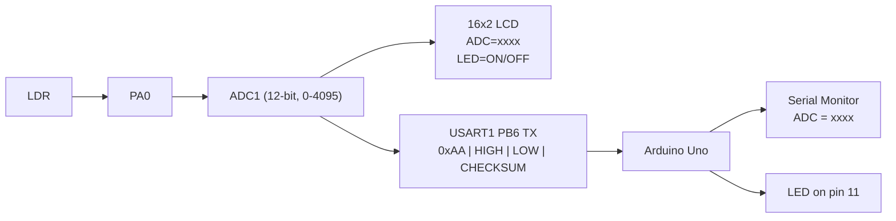
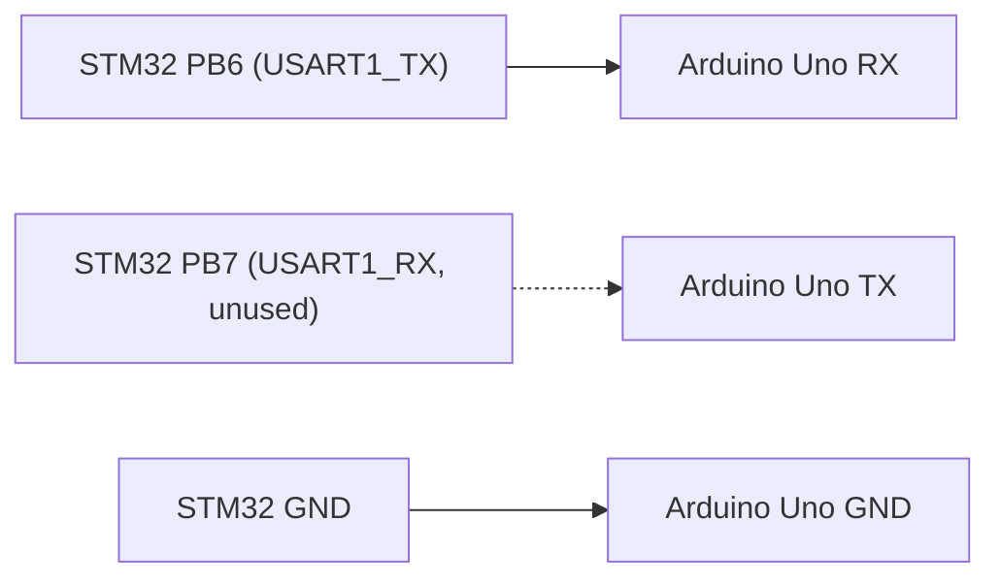
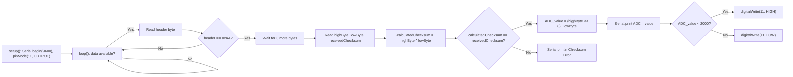

# 📟 UART Communication with Arduino Uno and 16×2 LCD (STM32 Bare-Metal)

**Difficulty Level:** Advanced

A bare-metal STM32 project that reads an LDR through ADC1, displays the reading and a derived LED status on a 16×2 character LCD (4-bit mode), and transmits the ADC value as a framed binary packet over USART1 to an Arduino Uno, which verifies the packet with a checksum, prints it to the Serial Monitor, and drives its own LED. All STM32-side peripherals (GPIO, ADC1, USART1, and the LCD bit-banged interface) are configured through direct register access, with no HAL calls; the Arduino side is a standard `.ino` sketch using `Serial`/`digitalWrite`.


---

## 📖 Project Overview

This project combines four register-level/embedded skills into one system: ADC sampling, an LCD driven in 4-bit mode over bit-banged GPIO, USART1 transmission of a framed binary packet, and an Arduino Uno decoding that packet to drive its own LED and Serial Monitor output.

**Data flow**



**Target Users**
- Embedded students learning register-level ADC, bit-banged LCD, and UART framing together in one project
- Developers designing a binary packet protocol for MCU-to-MCU communication
- Anyone debugging GPIO pin-resource conflicts between peripherals sharing the same port

---

## ✨ Features

- 12-bit, single-conversion, software-triggered ADC reading of an LDR on PA0
- 16×2 HD44780-compatible LCD driven in 4-bit mode via bit-banged GPIO (no LCD library)
- LCD shows a live `ADC=xxxx` reading and a derived `LED=ON`/`LED=OFF` status line
- ADC value transmitted over USART1 as a 4-byte framed binary packet (header, high byte, low byte, XOR checksum) — not as ASCII digits
- USART1 configured at 9600 baud on PB6 (TX) / PB7 (RX)
- Arduino Uno sketch decodes the packet, verifies the checksum, prints `ADC = xxxx` to the Serial Monitor, and drives an LED on pin 11 using the same 2000 threshold as the LCD

---

## 🛠️ Technologies Used

- **MCU:** STM32F411RE (Nucleo-F411RE), ARM Cortex-M4
- **Language:** Bare-metal C (direct register manipulation, no HAL/LL drivers)
- **Toolchain:** STM32CubeIDE (GCC ARM toolchain, `arm-none-eabi-gcc`)
- **Peripherals:** RCC, GPIOA/B/C, ADC1, USART1
- **Display:** 16×2 HD44780-compatible LCD (4-bit interface)
- **Companion board:** Arduino Uno, Arduino IDE
- **Debug:** Logic analyzer (for UART frame verification)

---

## 📁 Folder Structure

```
09_UART_Communication_with_Arduino_Uno_and_16x2_LCD/
├── Src/
│   ├── main.c              # STM32: GPIO/ADC1/USART1/LCD init, main loop
│   ├── syscalls.c           # Auto-generated syscall stubs
│   └── sysmem.c              # Auto-generated heap management stubs
├── Startup/
│   └── startup_stm32f411retx.s   # Reset handler and vector table
├── ARDUINO_code.c              # Arduino sketch logic: packet decode, checksum, Serial + LED output
├── STM32F411RETX_FLASH.ld    # Flash linker script
├── STM32F411RETX_RAM.ld       # RAM linker script
├── .project / .cproject        # STM32CubeIDE project files
└── ...Debug.launch              # Debug launch configuration
```

---

## 🔌 Hardware & Connections

| Component | Purpose |
|---|---|
| STM32 Nucleo-F411RE | Main microcontroller |
| LDR | Light sensor |
| 16×2 HD44780-compatible LCD | Displays ADC value and LED status |
| 320 Ω resistor | LCD backlight current limiting |
| Potentiometer | LCD contrast (V0) |
| Arduino Uno | Packet receiver / secondary LED driver |
| LED + current-limiting resistor | Arduino-side status indicator (pin 11) |
| Jumper wires | Connections |

**STM32 → LCD (final pin mapping)**

| LCD Pin | STM32 Pin |
|---|---|
| RS | PA1 |
| E | PA4 |
| D4 | PC0 |
| D5 | PC1 |
| D6 | PA6 |
| D7 | PA5 |

**LCD power**

| LCD Pin | Connection |
|---|---|
| VSS | GND |
| VDD | 5 V |
| V0 | Potentiometer wiper |
| A | 5 V through 320 Ω |
| K | GND |

**Why the LCD pins moved:** D4/D5 were originally on PA2/PA3, which conflicted with USART pins reserved for UART communication. The conflict caused the LCD to show block characters instead of text. Moving D4/D5 to PC0/PC1 (keeping D6→PA6, D7→PA5) resolved it.

**USART1 (STM32 → Arduino)**



---

## ⚙️ How It Works

1. `GPIO_Init()` enables the GPIOA, GPIOB, and GPIOC clocks; sets PA0 to analog mode (ADC1_IN0); sets PA1, PA4, PA5, PA6 to output mode (LCD RS, E, D7, D6); and sets PC0, PC1 to output mode (LCD D4, D5).
2. `ADC_Init()` configures ADC1 for 12-bit resolution, single-conversion/software-triggered mode, channel 0 first in a 1-conversion sequence, 84-cycle sampling time, and a PCLK2/8 clock prescaler — the same configuration used in the earlier ADC-only project.
3. `USART1_INIT()` enables the USART1 clock, sets PB6/PB7 to Alternate Function 7 (USART1_TX/RX), sets the baud-rate register for 9600 baud, and enables the transmitter, receiver, and the USART peripheral itself. Note: the receiver (`RE`) is enabled here, but nothing in `main()` ever calls `USART1_ReceiveChar()` — it's configured but unused on the STM32 side.
4. `LCD_Init()` runs the standard HD44780 4-bit initialization sequence (`0x03 × 3`, `0x02`, then `0x28`/`0x0C`/`0x06`/`0x01`) with a startup delay, switching the display into 4-bit/2-line/5×8-font mode, turning the display on with the cursor off, setting auto-increment, and clearing the display.
5. The main loop repeatedly:
   - Reads the ADC (`ADC_Read()`).
   - Moves the LCD cursor to the start of line 1 (`LCD_Command(0x80)`) and calls `LCD_DisplayADC()`, which prints `ADC=xxxx` on line 1, moves to line 2 (`LCD_Command(0xC0)`), and prints `LED=ON␣` or `LED=OFF` — the trailing space after `ON` exists specifically to overwrite the leftover `F` from a previous `OFF` (see "Problems Faced and Fixes" below).
   - Sends the same ADC value as a 4-byte binary packet over USART1 (`USART1_SendADC()`).
   - Delays (`delay(300000)`) before repeating.

**LCD nibble transfer:** `LCD_SendNibble()` splits each nibble into D7–D4 by shifting, writes D6/D7 to PA6/PA5 and D4/D5 to PC0/PC1, then pulses E (PA4) high then low with short delays between. `LCD_Command()` clears RS (PA1) before sending a byte's high nibble then low nibble; `LCD_Data()` sets RS before doing the same.

**UART packet format**

```
Byte:      0xAA        highByte      lowByte      checksum
Meaning:   header     ADC[15:8]     ADC[7:0]    highByte ^ lowByte
```

A 16-bit binary value (0–65535 range) is used instead of 2 ASCII nibbles/digits, because the ADC's 0–4095 range doesn't fit in a single byte (0–255) — two raw bytes are needed regardless of encoding, and sending them as binary rather than 4 ASCII characters keeps the packet fixed at 4 bytes with a built-in integrity check, rather than 4+ bytes of ASCII with no checksum.

---

## 🧩 Code Explanation (Register-Level, STM32 side)

**RCC**

| Register | Bit(s) | Field | Value | Purpose |
|---|---|---|---|---|
| AHB1ENR | 0 | GPIOAEN | 1 | Enables GPIOA clock |
| AHB1ENR | 1 | GPIOBEN | 1 | Enables GPIOB clock (USART1 AF pins) |
| AHB1ENR | 2 | GPIOCEN | 1 | Enables GPIOC clock (LCD D4/D5) |
| APB2ENR | 4 | USART1EN | 1 | Enables USART1 clock |
| APB2ENR | 8 | ADC1EN | 1 | Enables ADC1 clock |

**GPIOA / GPIOB / GPIOC**

| Register | Bit(s) | Field | Value | Purpose |
|---|---|---|---|---|
| GPIOA_MODER | [1:0] | MODER0 | 11 | PA0 = Analog (ADC1_IN0) |
| GPIOA_MODER | [3:2] | MODER1 | 01 | PA1 = Output (LCD RS) |
| GPIOA_MODER | [9:8] | MODER4 | 01 | PA4 = Output (LCD E) |
| GPIOA_MODER | [11:10] | MODER5 | 01 | PA5 = Output (LCD D7) |
| GPIOA_MODER | [13:12] | MODER6 | 01 | PA6 = Output (LCD D6) |
| GPIOC_MODER | [1:0] | MODER0 | 01 | PC0 = Output (LCD D4) |
| GPIOC_MODER | [3:2] | MODER1 | 01 | PC1 = Output (LCD D5) |
| GPIOB_MODER | [13:12] | MODER6 | 10 | PB6 = Alternate Function (USART1_TX) |
| GPIOB_MODER | [15:14] | MODER7 | 10 | PB7 = Alternate Function (USART1_RX) |
| GPIOB_AFRL | [27:24] | AFSEL6 | 0111 | PB6 → AF7 (USART1_TX) |
| GPIOB_AFRL | [31:28] | AFSEL7 | 0111 | PB7 → AF7 (USART1_RX) |
| GPIOA_ODR | 1 | ODR1 | 0 / 1 | LCD RS: 0 = command, 1 = data |
| GPIOA_ODR | 4 | ODR4 | pulsed | LCD E: enable pulse per nibble |
| GPIOA_ODR | 5, 6 | ODR5, ODR6 | data | LCD D7, D6 |
| GPIOC_ODR | 0, 1 | ODR0, ODR1 | data | LCD D4, D5 |

**ADC1** *(same configuration pattern as the earlier ADC-only project)*

| Register | Bit(s) | Field | Value | Purpose |
|---|---|---|---|---|
| CR1 | [25:24] | RES | 00 | 12-bit resolution |
| SMPR2 | [2:0] | SMP0 | 100 | Channel 0 sampling time = 84 cycles |
| SQR1 | [23:20] | L | 0000 | 1 conversion in the regular sequence |
| SQR3 | [4:0] | SQ1 | 00000 | Channel 0 selected as the 1st conversion |
| CR2 | 0 | ADON | 1 | Turns the ADC on |
| CR2 | 1 | CONT | 0 | Single-conversion mode |
| CR2 | 11 | ALIGN | 0 | Right-aligned data |
| CR2 | 10 | EOCS | 0 | EOC flag set at end of sequence |
| CR2 | [29:28] | EXTEN | 00 | Hardware trigger disabled — software start only |
| CR2 | 30 | SWSTART | 1 | Starts a conversion (set in `ADC_Read()`) |
| SR | 1 | EOC | polled | End-of-conversion flag |
| DR | [11:0] | DATA | — | 12-bit conversion result |
| CCR | [17:16] | ADCPRE | 11 | ADC clock = PCLK2 / 8 |

**USART1**

| Register | Bit(s) | Field | Value | Purpose |
|---|---|---|---|---|
| CR1 | 15 | OVER8 | 0 | Oversampling by 16 |
| CR1 | 3 | TE | 1 | Transmitter enabled |
| CR1 | 2 | RE | 1 | Receiver enabled (configured but unused in `main()`) |
| CR1 | 13 | UE | 1 | USART enabled |
| BRR | [15:4] | DIV_Mantissa | 104 | Baud-rate mantissa |
| BRR | [3:0] | DIV_Fraction | 3 | Baud-rate fraction (mantissa+fraction ≈ 104.1875 → ~9600 baud at 16 MHz PCLK2) |
| SR | 7 | TXE | polled | Transmit data register empty, checked before each write |
| SR | 5 | RXNE | — | Receive data register not empty (checked by the unused `USART1_ReceiveChar()`) |
| DR | [8:0] | DATA | — | Byte written/read here |

---

## 🐛 LCD Debugging Notes

**The block-character problem:** the LCD initially showed block-like characters instead of text. This looked like an LCD wiring or initialization fault, but the actual cause was a GPIO resource conflict — LCD D4/D5 were originally on PA2/PA3, which were also needed for UART. Moving D4/D5 to PC0/PC1 fixed it. Lesson: garbled LCD output doesn't always mean the LCD itself is faulty — it can also mean two peripherals are fighting over the same pins.

**Isolating the LCD first:** before attempting to display the ADC value, the LCD was tested standalone with the string `"Hello"`. Once that displayed correctly, LCD wiring, initialization, 4-bit transfer, RS control, and Enable control were all confirmed working — isolating the LCD from the ADC/UART portions of the system before combining them.

**The "LED=ONF" bug:** LCD character cells aren't automatically cleared when a shorter string overwrites a longer one. Writing `LED=OFF` (3 characters after `=`) and then `LED=ON` (2 characters) left the old trailing `F` in DDRAM, showing `LED=ONF`. The fix was writing an explicit space after `ON` (`LCD_Data(' ')`) so it overwrites the leftover character — visible in `LCD_DisplayADC()` today.

**The `uint16_t` delay bug:** the delay function originally took a `uint16_t` parameter, capping it at 65535 — too small for a delay like 100000. Changing the parameter to `uint32_t` fixed it; the final `delay()` in the source does take `uint32_t n`.

---

## 🔎 UART Frame Verification

The UART link was checked with a logic analyzer, which confirmed the `0xAA` header byte was being transmitted as expected. A frame error (FE) initially appeared at a 200 kHz analyzer sampling rate but disappeared at 4 MHz — indicating the issue was the analyzer's own sampling configuration rather than a fault in the UART signal itself.

---

## 🤖 Arduino-Side Code

`ARDUINO_code.c` (an Arduino `.ino`-style sketch) implements the receiving end:



`setup()` starts the Serial port at 9600 baud (matching the STM32's USART1 baud rate) and configures pin 11 as an output. `loop()` only acts when `Serial.available() > 0`; after reading a byte, it checks for the `0xAA` header, then busy-waits (`while (Serial.available() < 3) {}`) until the remaining 3 bytes have arrived before reading them. The checksum is recomputed with the same `highByte ^ lowByte` the STM32 used to generate it, and only on a match is the 16-bit ADC value reconstructed, printed, and used to drive pin 11 against the same 2000 threshold the STM32/LCD use. A checksum mismatch prints `Checksum Error` and the packet is otherwise discarded.

---

## 💻 Installation

1. Install [STM32CubeIDE](https://www.st.com/en/development-tools/stm32cubeide.html) and the [Arduino IDE](https://www.arduino.cc/en/software).
2. Clone the repository:
   ```bash
   git clone https://github.com/anshukumar146/STM32F411RE-Bare-Metal-Projects.git
   ```
3. In STM32CubeIDE, go to **File → Open Projects from File System** and import:
   ```
   09_UART_Communication_with_Arduino_Uno_and_16x2_LCD
   ```
4. In the Arduino IDE, open `ARDUINO_code.c` (save/rename with an `.ino` extension if needed) to flash to the Arduino Uno.

---

## ▶️ Running

1. Connect the Nucleo-F411RE board via USB (onboard ST-Link).
2. Build and flash the STM32 project: **Project → Build Project**, then **Run → Debug** (or **Run**).
3. Connect the Arduino Uno, select its COM port and board in the Arduino IDE, and upload `ARDUINO_code.c`.
   - If upload fails with `Access is denied` on the COM port, close the Serial Monitor and any other program using that port, confirm the correct port is selected, and reconnect the USB cable before retrying.

---

## 🕹️ Usage

1. Wire the LDR to PA0 and the LCD per the pin mapping above.
2. Wire STM32 PB6 (USART1_TX) to the Arduino's RX pin, with a common ground.
3. Power on the STM32 — the LCD should show `ADC=xxxx` on line 1 and `LED=ON`/`LED=OFF` on line 2, updating roughly every loop iteration.
4. Open the Arduino IDE's Serial Monitor at 9600 baud — it should print `ADC = xxxx` (or `Checksum Error` on a bad packet), and the Arduino's LED on pin 11 should track the same ADC < 2000 threshold as the LCD.

---

## 📸 Screenshots


## 🎥 Demo Video


https://github.com/user-attachments/assets/e8eeca84-c747-4772-8dd3-a19785a6e217


https://github.com/user-attachments/assets/222fdc82-5f11-42c1-9540-8e8813631728


https://github.com/user-attachments/assets/0441765f-1631-429e-83df-2d2206f69314


---
For more video and picture related to the project visit: https://drive.google.com/drive/folders/1Rp_FsnL-KTtCG4zOjCzzdXiQAO8WQBSM?usp=sharing
---

## ✅ Results

| Test | Result |
|---|---|
| ADC conversion (single, software-triggered) | ✅ Working |
| LCD 4-bit init and `"Hello"` test | ✅ Working |
| `ADC=xxxx` / `LED=ON`/`OFF` display, including the trailing-space fix | ✅ Working |
| LCD pin-conflict resolution (D4/D5 moved to PC0/PC1) | ✅ Working |
| USART1 packet transmission (`0xAA` header confirmed via logic analyzer) | ✅ Working |
| Logic analyzer frame error at 200 kHz sampling, resolved at 4 MHz | ✅ Resolved (tooling issue, not a UART fault) |
| Arduino packet reception, checksum verification, Serial output, LED control | ✅ Working |

---

## 🚀 Future Improvements

- Replace the STM32-side busy-wait `delay()` calls with a timer-based delay
- Replace the Arduino's `while (Serial.available() < 3) {}` busy-wait with a non-blocking state machine, so a dropped/partial packet can't stall `loop()`
- Use the already-enabled STM32 USART1 receiver for two-way communication (e.g. Arduino acknowledging receipt)
- Add a timeout/resync mechanism on the Arduino side in case a byte is dropped mid-packet
- Move the LCD driver into a small reusable bare-metal HD44780 library
- Replace polling with USART1/ADC interrupts or DMA on the STM32 side

---

## 📚 Learning Outcomes

**STM32:** GPIO clock enabling across multiple ports, GPIO analog/output/alternate-function configuration, ADC single-conversion sampling, USART1 baud-rate calculation, bit-banged HD44780 4-bit LCD driving (command/data distinction via RS, nibble splitting, enable pulsing, cursor positioning).

**Protocol design:** Binary vs. ASCII payload trade-offs, header/synchronization bytes, XOR checksums for basic integrity checking, structuring a fixed-length framed packet.

**Embedded C:** `volatile`, pointer-based register access, bit manipulation and masking, fixed-width integer overflow (`uint16_t` vs `uint32_t` delay parameter).

**Hardware debugging:** Diagnosing a GPIO pin-resource conflict that looked like an LCD fault, isolating subsystems (`"Hello"` test before ADC integration) before combining them, distinguishing a logic-analyzer sampling-rate artifact from an actual protocol fault, and tracking down an "access is denied" COM-port issue.

---

## 🧩 Skills Demonstrated

- Bare-Metal STM32 Register Programming (RCC, GPIO, ADC1, USART1)
- Bit-Banged HD44780 LCD Driving (4-bit mode)
- Binary Packet Protocol Design with Checksum
- Multi-System Integration (ADC + LCD + UART)
- Hardware/Tooling Debugging (pin conflicts, logic analyzer, COM ports)
- Technical Documentation

---

## 👤 Author

**Anshu Kumar**
GitHub: [@anshukumar146](https://github.com/anshukumar146)

---

## 📄 License

This project is licensed under the MIT License. Note that `startup_stm32f411retx.s` and the `.ld` linker scripts are STM32CubeIDE/STMicroelectronics-generated boilerplate, licensed under terms provided by STMicroelectronics (see the file headers).

```
MIT License

Copyright (c) 2026 Anshu Kumar

Permission is hereby granted, free of charge, to any person obtaining a copy
of this software and associated documentation files (the "Software"), to deal
in the Software without restriction, including without limitation the rights
to use, copy, modify, merge, publish, distribute, sublicense, and/or sell
copies of the Software, and to permit persons to whom the Software is
furnished to do so, subject to the following conditions:

The above copyright notice and this permission notice shall be included in all
copies or substantial portions of the Software.

THE SOFTWARE IS PROVIDED "AS IS", WITHOUT WARRANTY OF ANY KIND, EXPRESS OR
IMPLIED, INCLUDING BUT NOT LIMITED TO THE WARRANTIES OF MERCHANTABILITY,
FITNESS FOR A PARTICULAR PURPOSE AND NONINFRINGEMENT. IN NO EVENT SHALL THE
AUTHORS OR COPYRIGHT HOLDERS BE LIABLE FOR ANY CLAIM, DAMAGES OR OTHER
LIABILITY, WHETHER IN AN ACTION OF CONTRACT, TORT OR OTHERWISE, ARISING FROM,
OUT OF OR IN CONNECTION WITH THE SOFTWARE OR THE USE OR OTHER DEALINGS IN THE
SOFTWARE.
```

---

## 🙏 Acknowledgements

- STM32F411RE Reference Manual (RM0383) and Datasheet, STMicroelectronics
- HD44780 LCD controller datasheet
- STM32CubeIDE and Arduino IDE documentation
